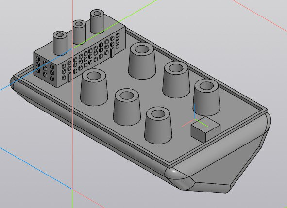
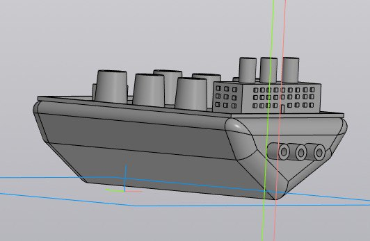
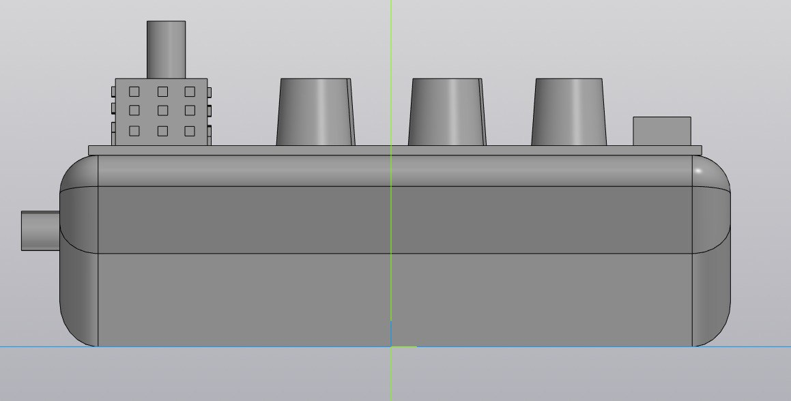
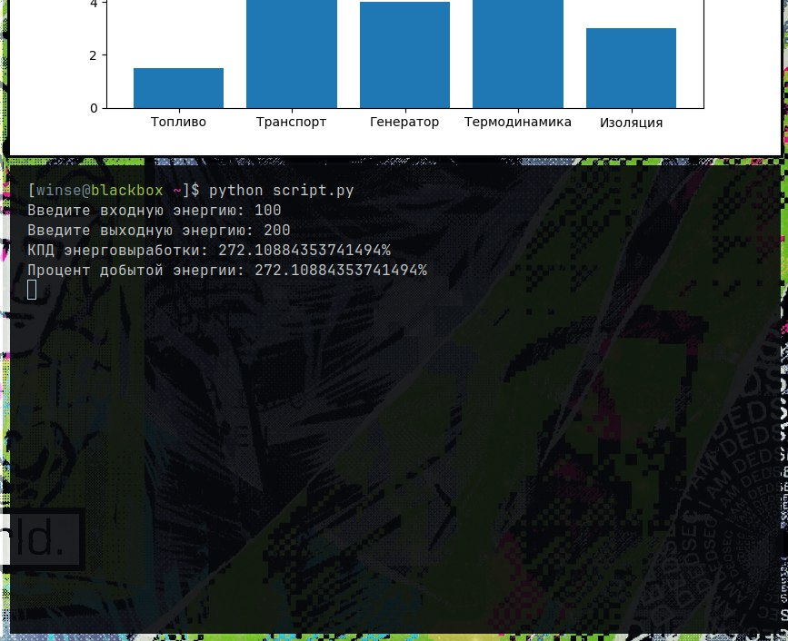
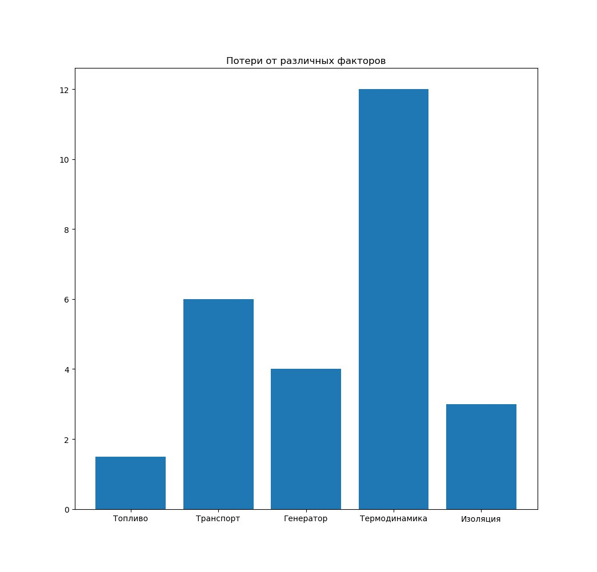

Authors: Korabelnikov Danila Alekseevich, Syhov Ivan Sergeevich \n
Scientific director: Epifantsew Sergei Vladimirovich
Consultant: Gertsovsky Georgy Alexandrovich

## About this project


This project is a simulated 3D model of a floating thermal power plant and a script for calculating the efficiency and efficiency of the extracted energy

### Goals

- [x] Make a 3D model
- [x] Make a script
- [x] Analyze the market

Screenshots of 3D model:





## Script

This script can be used to calculate energy processing efficiency

Screenshots of script:




In the future i want to analyze more negative factors and upgrade my script!

## Installation of script

```
git clone https://W1NS3/Floating-thermal-power-plant.git
cd Floating-thermal-power-plant/src
python -m pip install -U matplotlib
```
Now you are able to use script
